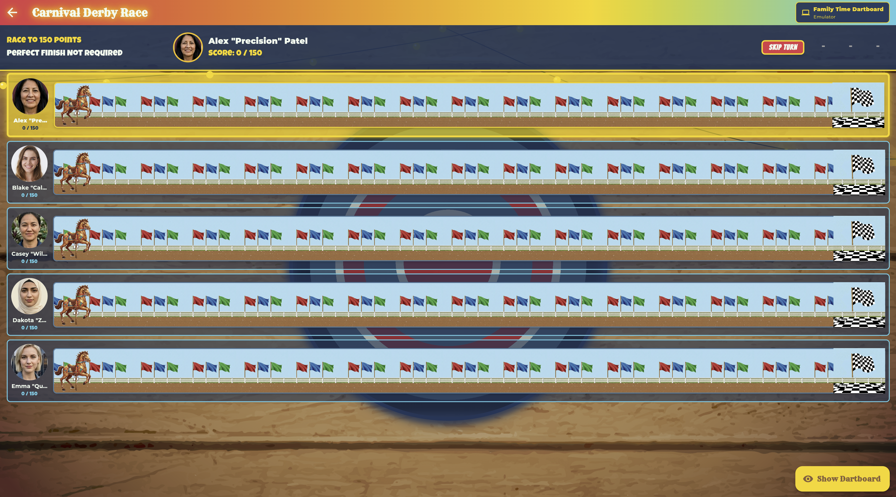
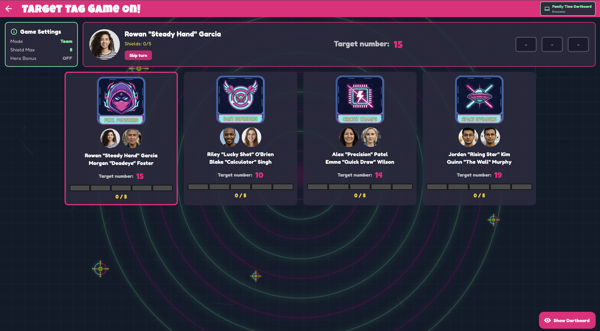
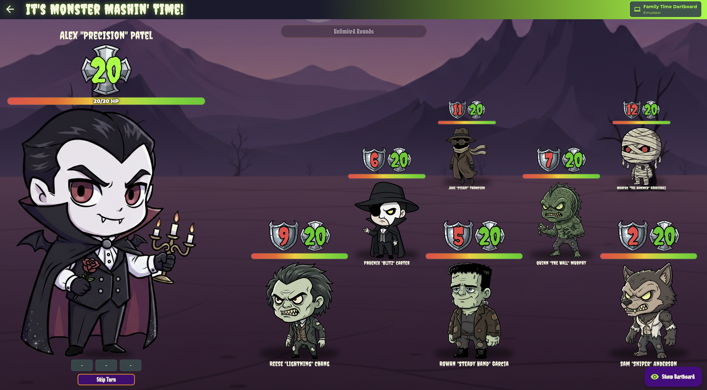
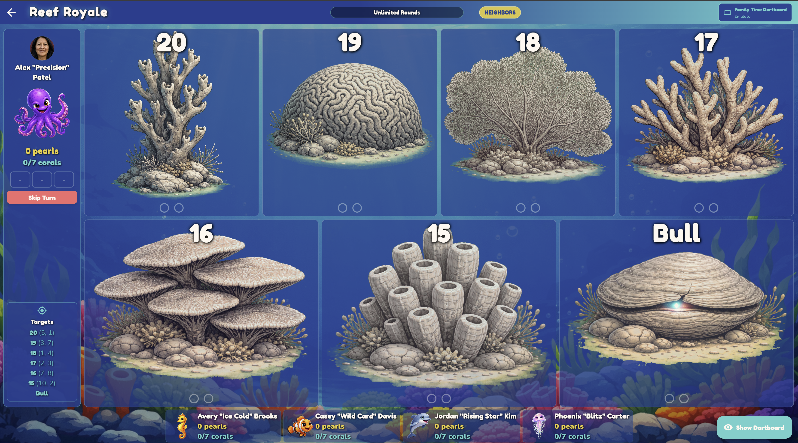
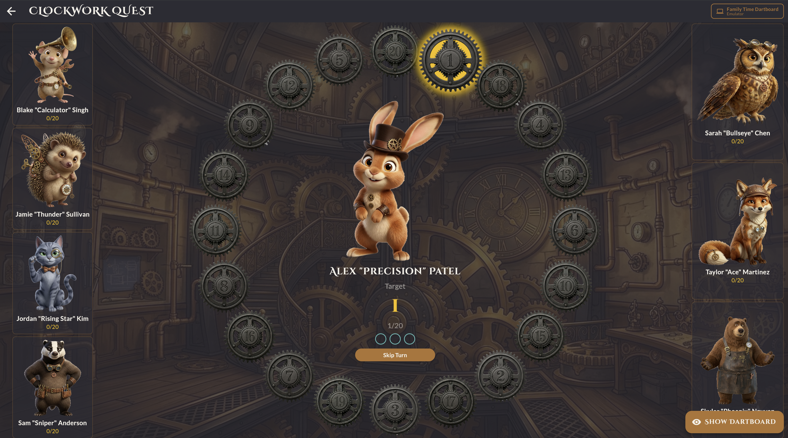
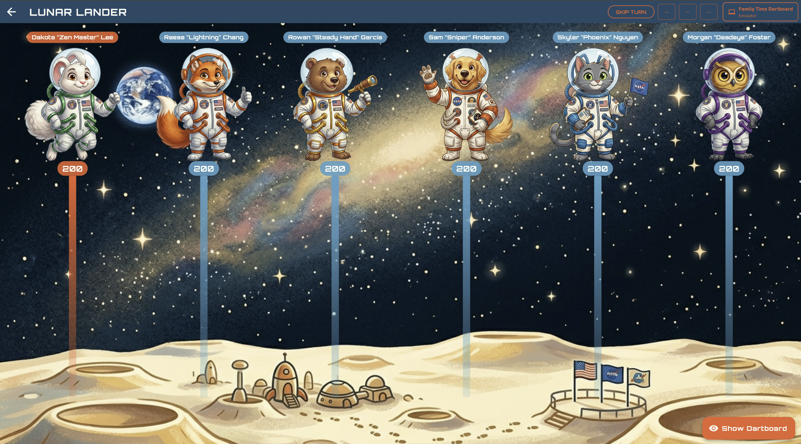
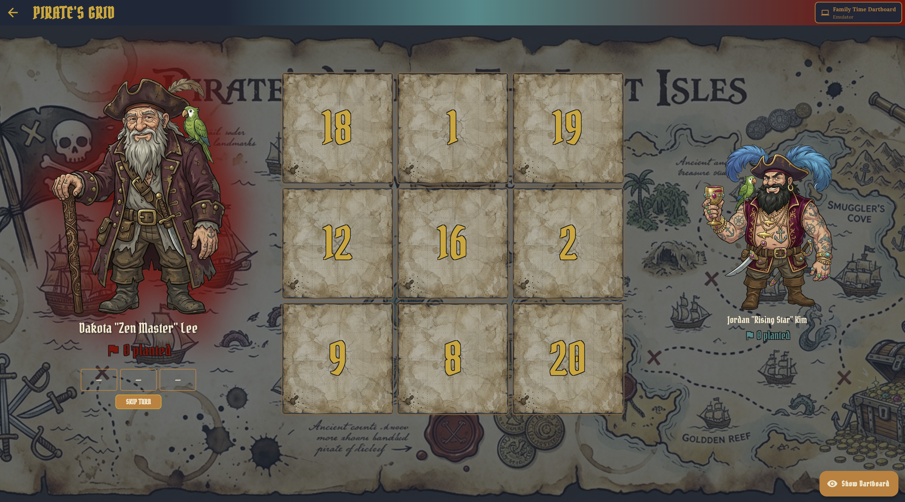
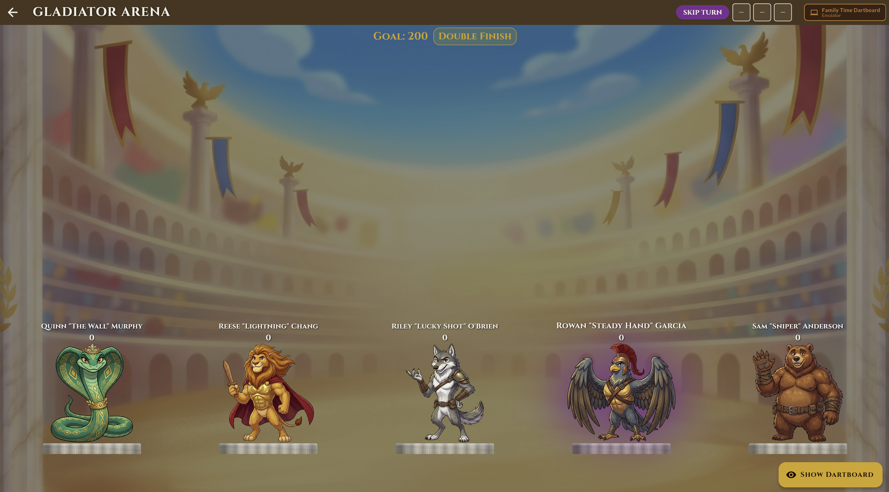
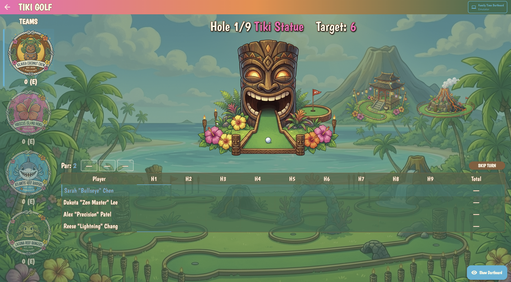
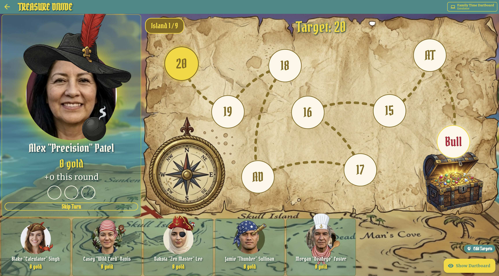

# Dart Games

A collection of family-friendly dart games for the **Scolia 2** smart dartboard. Built on a shared Flutter container app so each new game inherits dartboard connection, player management, save/resume, announcements, and victory music — and gets to focus on its own theme and rules.

> **Requires a Scolia 2 dartboard and API key.** Contact [Scolia](https://scolia.com) for an API key. Each game also runs against a built-in dartboard emulator for development without hardware.

## The games

| Game | Players | Modes | Theme |
|---|---|---|---|
| Carnival Derby | 2–8 | Solo | Horse racing — first horse past the finish wins |
| Target Tag | 2–10 | Solo + Team | Shield duel — tag opponents with their target number |
| Monster Mash | 2–8 | Solo | Monster battle — heal your monster, smash the others |
| Reef Royale | 2–8 | Solo | Coral claiming — race to claim reefs around the board |
| Clockwork Quest | 2–8 | Solo | Steampunk gear progression around the board |
| Lunar Lander | 2–8 | Solo | Retro NASA countdown |
| Pirate's Grid | 2 | Solo | Treasure-map tic-tac-toe |
| Gladiator Arena | 2–8 | Solo | Eliminator — race to a target score, ancient-arena theme |
| Tiki Golf | 2–16 | Solo + Team | Lilo & Stitch–styled mini-golf dart game across 9 or 18 holes |
| Treasure Divide | 2–8 Solo / 3–10 Team | Solo + Team | Halve It pirate adventure — plunder gold across treasure islands, miss all 3 darts and HALF spills overboard |

## Screenshots

| Carnival Derby | Target Tag | Monster Mash |
|---|---|---|
|  |  |  |

| Reef Royale | Clockwork Quest | Lunar Lander |
|---|---|---|
|  |  |  |

| Pirate's Grid | Gladiator Arena | Tiki Golf |
|---|---|---|
|  |  |  |

| Treasure Divide | | |
|---|---|---|
|  | | |

## Reusable components

Every game is wired into a shared toolkit so adding a new one is mostly theming and rules — not infrastructure. The shared layer covers:

- **Dartboard connection** (real Scolia 2 or local emulator) with reactive throw events
- **Global player roster, stats, and game history**
- **Add Player, Edit Score, Resume Game, Save Game** modals — themed per game via config factories
- **Solo and team modes** — shared player-list panel handles both flavors; games opt in per spec and inherit random/manual crew assignment, solo-crew fallbacks, per-crew rankings, and team-tied results screens
- **Save & resume** mid-game state, persisted via the embedded Dart Shelf + SQLite backend
- **Priority-based announcement queue** (voice + sound effects, multi-personality TTS)
- **Per-game victory music** with random selection from a user-managed library
- **Play-to-complete auto-play** — per-game strategies drive a shared runner that walks a game to a finish for demos, tests, and screenshots
- **Skip-turn helper, remove-darts modal, dartboard paused modal** with consistent rules across games
- **Home-screen game filter bar** with auto-registered metadata for each new game
- **Touch-screen QWERTY keyboard** slides up whenever a text field gains focus in touch mode — no per-game wiring needed

## Adding a new game

Use the project skill `/game.build` from inside `dart_games/` and pass the game's spec file:

```
/game.build docs/research/games/tier1/your-new-game.md
```

The skill is an orchestrated 11-phase pipeline (with adversarial reviews and hard test gates) that takes a research spec and produces a fully integrated, tested, and documented game. See `dart_games/.claude/skills/game.build/SKILL.md` for what it does at each phase.

## Quick start

```bash
git clone https://github.com/shuels2/dart-games.git
cd dart-games/dart_games

# Install dependencies (Flutter app + Dart server)
flutter pub get
cd server && dart pub get && cd ..

# Start the backend server
cd server && dart run bin/server.dart &

# Run on web
flutter run -d chrome
```

For the full development guide, testing setup, architecture docs, and per-game documentation, see [`dart_games/CLAUDE.md`](dart_games/CLAUDE.md).

## Platform support

Web (Chrome, Safari, Firefox, Edge), iOS tablets (iPad), and Android tablets.

## License

Apache License 2.0 — see [LICENSE](LICENSE).

## Contact

For Scolia API key inquiries: [https://scolia.com](https://scolia.com).
